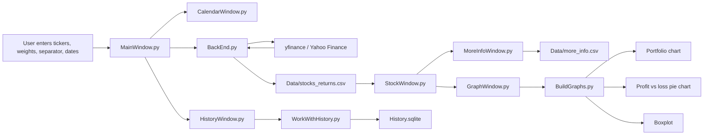

<p align="center">  </p>
<p align="center"> <a href="https://www.python.org/"></a> <a href="https://doc.qt.io/qtforpython-6/"></a>  <a href="https://finance.yahoo.com/"></a> <a href="https:///"></a> </p>
<p align="center"> <b>Track weighted stock portfolios, calculate historical returns, export CSV analytics, and visualize performance from a clean Qt desktop interface.</b> </p>
<p align="center"> <a href="#-features">Features</a> · <a href="#-quick-start">Quick Start</a> · <a href="#-usage">Usage</a> · <a href="#-architecture">Architecture</a> · <a href="#-roadmap">Roadmap</a> </p>
---

## 📌 Overview

**Yahoo Stocks** is a Python desktop application built with **PyQt6** for tracking the historical movement of an investment portfolio. The app fetches stock data from Yahoo Finance, calculates weighted daily portfolio returns, saves results to CSV, and provides visual analytics through multiple chart types.

It is designed as a compact portfolio-analysis tool for users who want to enter ticker symbols, assign portfolio weights, select a buy/sell date range, and quickly understand how the portfolio moved over time.

> **Disclaimer:** This project is for educational and analytical purposes only. It is not financial advice.

---

## ✨ Features

| Feature                               | Description                                                                                      |
| ------------------------------------- | ------------------------------------------------------------------------------------------------ |
| 📈 **Yahoo Finance data retrieval**   | Downloads historical close prices for selected stock tickers using `yfinance`.                   |
| ⚖️ **Weighted portfolio calculation** | Combines multiple assets according to user-defined portfolio weights.                            |
| 🗓️ **Calendar-based date selection** | Lets users choose start and end dates through a PyQt6 calendar dialog.                           |
| 📄 **CSV output**                     | Saves calculated portfolio returns to `Data/stocks_returns.csv`.                                 |
| 📊 **Portfolio charts**               | Generates portfolio movement, profit/loss ratio, and boxplot visualizations with Matplotlib.     |
| 🧮 **Statistical summary**            | Creates descriptive statistics such as count, mean, standard deviation, min, quartiles, and max. |
| 🗃️ **SQLite history layer**          | Includes a SQLite-backed module for storing and clearing query history.                          |
| 🖥️ **Desktop-first UI**              | Uses PyQt6 widgets, tables, dialogs, and multi-window navigation.                                |

---

## 🖼️ Visual Workflow



---

## 🧱 Tech Stack

| Layer             | Technology |
| ----------------- | ---------- |
| GUI               | PyQt6      |
| Market data       | yfinance   |
| Data processing   | pandas     |
| Visualization     | matplotlib |
| Local persistence | sqlite3    |
| Export format     | CSV        |

---

## 📁 Project Structure

```text
Yahoo-Stocks-QT6-app/
├── Qt project/
│   ├── BackEnd.py          # Yahoo Finance requests, weighted return calculation, CSV export
│   ├── BuildGraphs.py      # Matplotlib chart builders
│   ├── CalendarWindow.py   # Date picker dialog
│   ├── GraphWindow.py      # Chart selection window
│   ├── HistoryWindow.py    # History UI
│   ├── MainWindow.py       # Main PyQt6 application entry point
│   ├── MoreInfoWindow.py   # Statistical summary table
│   ├── StockWindow.py      # Portfolio return table and analytics actions
│   └── WorkWithHistory.py  # SQLite history helpers
├── Project presentation.pdf
├── LICENSE.md
└── README.md
```

---

## 🚀 Quick Start

### 1. Clone the repository

```bash
git clone https://github.com/whoIsClownHere/Yahoo-Stocks-QT6-app.git
cd Yahoo-Stocks-QT6-app
```

### 2. Create a virtual environment

#### macOS / Linux

```bash
python3 -m venv .venv
source .venv/bin/activate
```

#### Windows PowerShell

```powershell
python -m venv .venv
.venv\Scripts\Activate.ps1
```

### 3. Install dependencies

```bash
pip install PyQt6 pandas yfinance matplotlib
```

### 4. Create the data directory

The app writes generated CSV files into `Data/`.

#### macOS / Linux

```bash
mkdir -p "Qt project/Data"
```

#### Windows PowerShell

```powershell
New-Item -ItemType Directory -Force -Path "Qt project\Data"
```

### 5. Run the app

```bash
cd "Qt project"
python MainWindow.py
```

---

## 🧭 Usage

1. Open the application.

2. Enter stock tickers in the **stock name** field.

   Example:

   ```text
   AAPL, MSFT, NVDA
   ```

3. Enter portfolio weights in the same order.

   Example:

   ```text
   0.4, 0.35, 0.25
   ```

4. Keep or change the separator.

   Example:

   ```text
   , 
   ```

5. Select purchase and sale dates using the calendar buttons.

6. Click **Get Data**.

7. Review the generated return table.

8. Open charts or statistical summaries from the results window.

---

## 📊 Analytics

The app produces two main CSV outputs:

| File                      | Purpose                                                        |
| ------------------------- | -------------------------------------------------------------- |
| `Data/stocks_returns.csv` | Stores daily weighted portfolio return values.                 |
| `Data/more_info.csv`      | Stores descriptive statistics generated from the return table. |

Available visualizations:

* **Portfolio movement chart** — shows the overall movement of the portfolio.
* **Profit/loss pie chart** — compares the number of profitable and losing days.
* **Boxplot** — visualizes distribution, median, spread, and outliers.

---

## 🧩 Core Modules

### `MainWindow.py`

Main application window. It handles user input for tickers, weights, separators, and dates, then launches the calculation workflow.

### `BackEnd.py`

Fetches historical stock data using `yfinance`, calculates weighted portfolio movements, and writes return data to CSV.

### `StockWindow.py`

Displays calculated portfolio return data in a table and provides actions for charting and advanced information.

### `BuildGraphs.py`

Builds Matplotlib visualizations for portfolio movement, profit/loss distribution, and return distribution.

### `MoreInfoWindow.py`

Displays statistical summary data generated with pandas.

### `WorkWithHistory.py`

Contains SQLite helper functions for reading, writing, and clearing query history.

---

## 🖼️ Screenshots

The repository currently includes a project presentation PDF:

<p align="center">
  <a href="./Project%20presentation.pdf">
    
  </a>
</p>

Suggested screenshot layout for future updates:

```text
docs/assets/
├── main-window.png
├── results-table.png
├── portfolio-chart.png
├── statistics-window.png
└── graphs-window.png
```

After adding screenshots, you can embed them like this:

```md
<p align="center">
  
  
</p>
```

---

## 🛠️ Development Notes

A few improvements that would make the project easier to install and maintain:

* Add a `requirements.txt` file.
* Add input validation for missing tickers, invalid weights, empty dates, and unmatched ticker/weight counts.
* Use `pathlib` for reliable cross-platform paths.
* Ensure `Data/` is created automatically before CSV export.
* Package the project as an installable Python application.
* Add automated tests for portfolio-return calculations.
* Add GitHub Actions for linting and test execution.

---

## 🗺️ Roadmap

* [ ] Add `requirements.txt`
* [ ] Auto-create the `Data/` directory
* [ ] Improve ticker and weight validation
* [ ] Persist and replay query history from SQLite
* [ ] Add export buttons for generated charts
* [ ] Add application theme support
* [ ] Add tests for calculation logic
* [ ] Build standalone desktop releases with PyInstaller

---

## 🤝 Contributing

Contributions are welcome.

1. Fork the repository.

2. Create a feature branch.

   ```bash
   git checkout -b feature/your-feature-name
   ```

3. Commit your changes.

   ```bash
   git commit -m "Add your feature"
   ```

4. Push the branch.

   ```bash
   git push origin feature/your-feature-name
   ```

5. Open a pull request.

---

## 📜 License

This project is licensed under the **MIT License**. See [`LICENSE.md`](./LICENSE.md) for details.

---

<p align="center">
  <b>Made with Python, PyQt6, pandas, Matplotlib, SQLite, and Yahoo Finance data.</b>
</p>

<p align="center">
  
</p>
::: ​​
